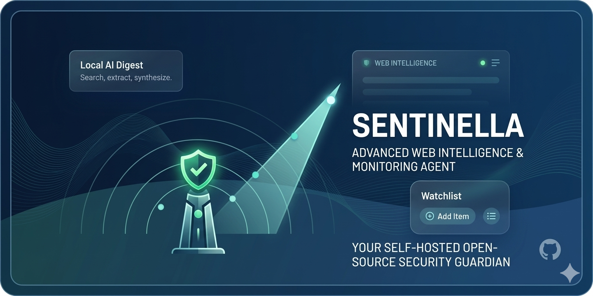

# Sentinella

<p align="center">
  
</p>

<p align="center">
  Ricerca web self-hosted con digest AI locale, watchlist schedulate e gestione multiutente.
</p>

<p align="center">
  
  
  
  
</p>

<p align="center">
  <a href="#panoramica">Panoramica</a> •
  <a href="#highlight">Highlight</a> •
  <a href="#architettura">Architettura</a> •
  <a href="#quick-start">Quick start</a> •
  <a href="#documentazione">Documentazione</a>
</p>

## Panoramica

**Sentinella** e una web app self-hosted pensata per ambienti LAN dove serve monitorare il web senza dipendere da servizi esterni a pagamento.

Unisce:

- ricerca web aggiornata via **SearXNG**
- sintesi locale in **Markdown** tramite **Ollama**
- **watchlist schedulate** con cron e deduplicazione URL
- accesso **multiutente** con JWT e ruoli `admin` / `user`

L'obiettivo e semplice: trasformare query ripetitive in un flusso operativo consultabile, tracciato e gestibile da interfaccia web.

## Highlight

| Area | Cosa offre |
| --- | --- |
| Ask | ricerca one-shot con digest AI e fonti citate |
| Watchlist | monitoraggio ricorrente con scheduler APScheduler |
| Storico run | tracciamento delle esecuzioni e dei risultati |
| Multiutente | login, ruoli, visibilita per utente o admin |
| Local-first | stack eseguibile interamente in Docker Compose |
| No API key | la ricerca web usa SearXNG, non provider esterni |

## Architettura

```text
Host :8001
   |
 nginx
   |-- /        -> frontend React/Vite
   `-- /api/*   -> FastAPI
                    |-- PostgreSQL
                    |-- SearXNG + Redis
                    |-- Ollama
                    `-- Worker APScheduler
```

Componenti principali:

- **Frontend**: React 18 + Vite
- **API**: FastAPI con autenticazione JWT, RBAC e rate limiting
- **Worker**: scheduler separato per watchlist personali e globali
- **Search**: SearXNG in output JSON
- **AI digest**: Ollama con modello locale
- **Database**: PostgreSQL 16

## Quick Start

```bash
cp .env.example .env
# imposta almeno JWT_SECRET
docker compose up --build
```

Accessi iniziali:

- UI: `http://localhost:8001`
- Health: `http://localhost:8001/api/health`
- Login default: `admin` / `admin123`

Note operative:

- al primo avvio viene scaricato il modello Ollama configurato
- cambiare subito la password dell'utente admin
- per un reset completo: `docker compose down -v`

## Flusso operativo

1. L'utente lancia una query da **Ask** oppure crea una **watchlist**.
2. Sentinella interroga **SearXNG** e raccoglie gli URL rilevanti.
3. Il contenuto viene estratto e normalizzato.
4. **Ollama** genera un digest Markdown basato solo sulle fonti raccolte.
5. Il risultato viene salvato come **run** consultabile dallo storico.

## Stack

| Layer | Tecnologia |
| --- | --- |
| UI | React 18, React Router, Vite |
| API | FastAPI, SQLAlchemy, Uvicorn |
| Worker | APScheduler |
| Search | SearXNG |
| Extraction | trafilatura, httpx |
| AI | Ollama |
| Data | PostgreSQL 16 |
| Proxy | nginx |
| Runtime | Docker Compose |

## Documentazione

La documentazione completa e in [`docs/`](docs/).

| Documento | Descrizione |
| --- | --- |
| [docs/setup.md](docs/setup.md) | installazione, bootstrap e verifica avvio |
| [docs/architecture.md](docs/architecture.md) | servizi, flussi e stack tecnologico |
| [docs/configuration.md](docs/configuration.md) | variabili d'ambiente e parametri |
| [docs/api.md](docs/api.md) | riferimento API REST |
| [docs/data-model.md](docs/data-model.md) | schema database |
| [docs/user-guide.md](docs/user-guide.md) | utilizzo UI, watchlist e runs |
| [docs/development.md](docs/development.md) | testing, troubleshooting e sviluppo |

## Perche Sentinella

- mantiene il controllo dei dati dentro l'infrastruttura locale
- riduce il lavoro manuale sulle ricerche ripetitive
- rende consultabili nel tempo query, fonti e digest
- separa bene ricerca ad hoc, monitoraggio periodico e amministrazione utenti

## Stato del progetto

Il repository contiene un MVP estendibile, gia strutturato per uso interno con API, frontend, worker schedulato e stack Docker completo.
